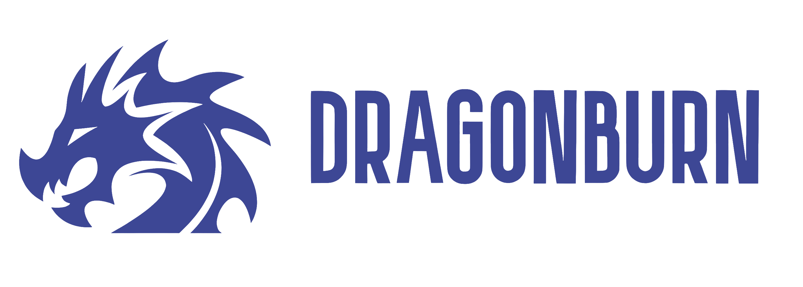
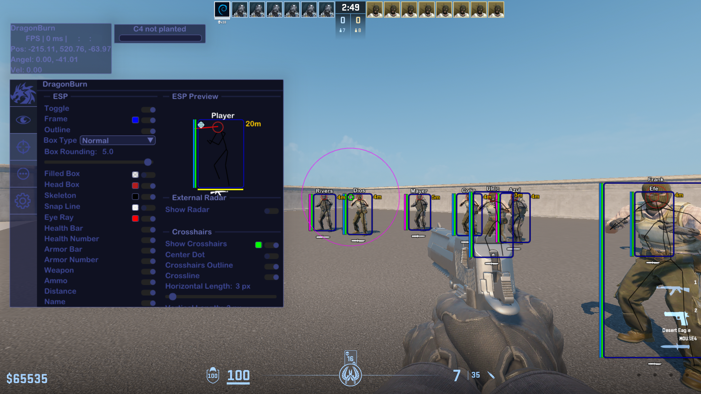
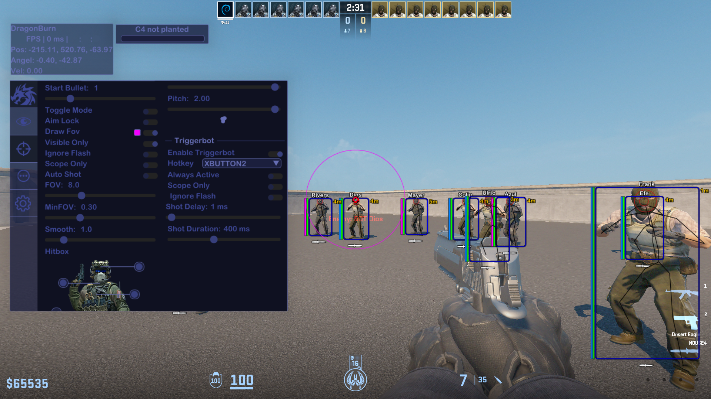

  
  
  
  
  
  
  
  
  
  

---
### It's one of the best CS2 external cheats with many cool features. Nowadays undetected by anti-cheat. Software written on C++.
⭐Please, star this repo if it was helpful⭐

---

<!--### 📋 Features

Visual

  
- ESP
- Glow
- Radar
- Crosshairs
- No Flash

Misc

- Bhop
- Aimbot
- Triggerbot
- Languages Settings
- Hit Sound
- Bomb Timer

----->

### 🖼️Prewiev

